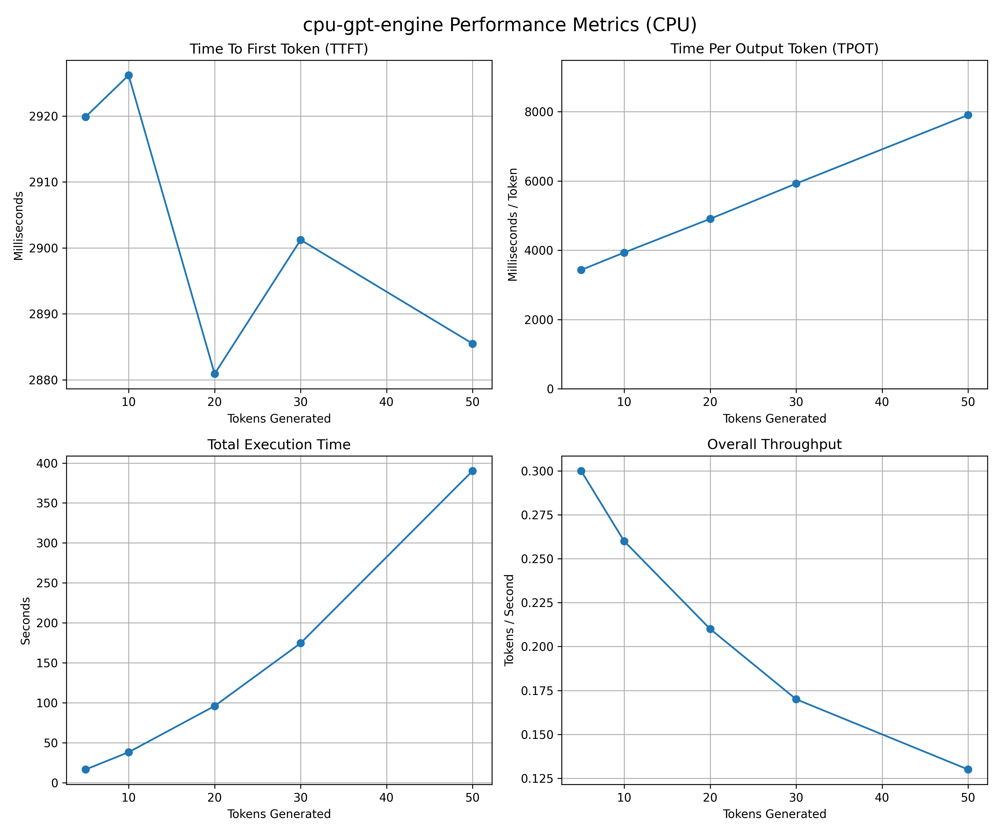
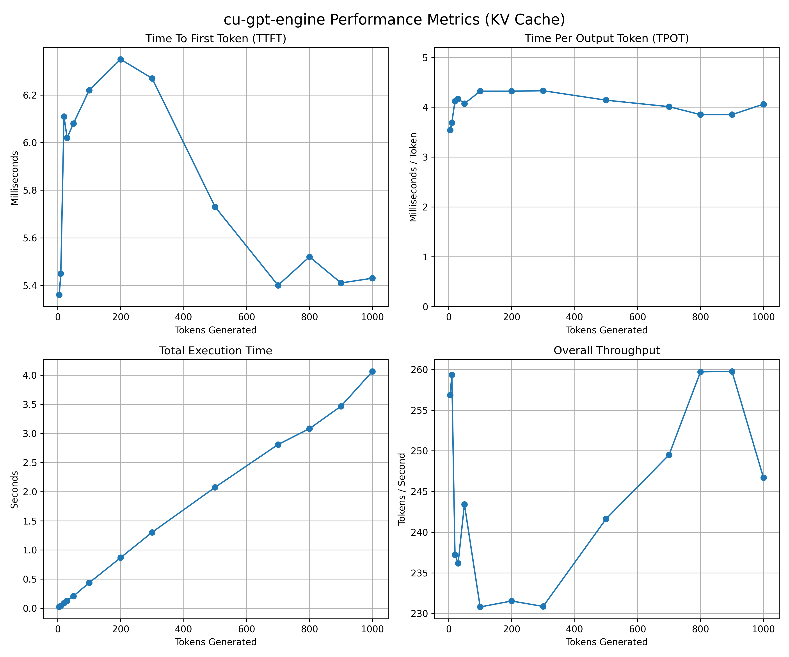

# gpt2-engine-cpp
> Custom GPT2 inference engine built from scratch in C++ and CUDA

# Overview
Project is meant to be a high performance implementation of
GPT2 (124M parameter) architecture.

# How to Run
`cmake -B build` 
`cmake --build build`
## CPU Version
`./build/src/gpt2_inference_engine_cpu`
## CPU Benchmarks
`./build/benchmarks/cpu_bench`

## CUDA Version
`./build/src/gpt2_inference_engine_cuda`

## CUDA Benchmarks
`./build/benchmarks/gpu_bench`

# Key Features
- Custom CUDA Kernels: Implemented custom multi-head attention, layer normalization, GELU activation, and fuesed matrix operations (only using cuBLAS)
- Cross-Framework Validation: Features and end to end python validation suite guarantees mathemematically identical output to huggingface version
- Deterministic: Can handle precise floating point arithmetic stability across matrix operations
- KV Caching

# Validation & Performance
- **Mathematical Correctness:** Achieved a Mean Squared Error (MSE) of effectively `0.0` and a Maximum Absolute Difference of `< 1e-3` in FP32 logit outputs compared to PyTorch's `F.scaled_dot_product_attention`.
- **Hardware Acceleration (CPU vs GPU):** Achieved up to a **544x reduction in latency** by migrating sequential C++ matrix operations to custom `__global__` CUDA kernels.
- **Throughput Scaling:** With KV caching enabled, achieved up to **1872.46x higher token throughput** at longer sequence lengths relative to the CPU implementation.
- **Hardware Efficiency:** Profiled via NVIDIA Nsight Compute (`ncu`), achieving **99.37% branch efficiency**, demonstrating highly optimized warp execution with minimal thread divergence.
- **Full-Stack Memory Safety:** Validated host execution via `valgrind` and device execution via NVIDIA `compute-sanitizer`, guaranteeing **0 memory leaks and 0 invalid out-of-bounds reads/writes** across millions of dynamic CPU and GPU tensor allocations.
- **CPU benchmarks for sequences larger than 50 tokens were omitted as they took a very long time so listed as N/A**

# CPU vs GPU Benchmark Comparison

| Tokens | CPU TTFT (ms) | GPU TTFT (ms) | Speedup (Latency) | CPU Total Time (s) | GPU Total Time (s) | Speedup (Total Time) | CPU Throughput (tok/s) | GPU Throughput (tok/s) | Speedup (Throughput) |
| ------ | ------------- | ------------- | ----------------- | ------------------ | ------------------ | -------------------- | ---------------------- | ---------------------- | -------------------- |
| 5      | 2919.88       | 5.36          | 544.75x           | 16.6428            | 0.01951            | 852.99x              | 0.30                   | 256.86                 | 856.20x              |
| 10     | 2926.20       | 5.45          | 536.92x           | 38.3236            | 0.03865            | 991.56x              | 0.26                   | 259.34                 | 997.46x              |
| 20     | 2880.89       | 6.11          | 471.50x           | 96.0915            | 0.08435            | 1139.20x             | 0.21                   | 237.23                 | 1129.67x             |
| 30     | 2901.22       | 6.02          | 481.93x           | 174.708            | 0.12706            | 1374.98x             | 0.17                   | 236.18                 | 1389.29x             |
| 50     | 2885.47       | 6.08          | 474.58x           | 390.183            | 0.20542            | 1899.44x             | 0.13                   | 243.42                 | 1872.46x             |
| 100    | N/A           | 6.22          | N/A               | N/A                | 0.43376            | N/A                  | N/A                    | 230.81                 | N/A                  |
| 200    | N/A           | 6.35          | N/A               | N/A                | 0.86553            | N/A                  | N/A                    | 231.54                 | N/A                  |
| 300    | N/A           | 6.27          | N/A               | N/A                | 1.30069            | N/A                  | N/A                    | 230.87                 | N/A                  |
| 500    | N/A           | 5.73          | N/A               | N/A                | 2.07385            | N/A                  | N/A                    | 241.63                 | N/A                  |
| 700    | N/A           | 5.40          | N/A               | N/A                | 2.80812            | N/A                  | N/A                    | 249.50                 | N/A                  |
| 800    | N/A           | 5.52          | N/A               | N/A                | 3.08160            | N/A                  | N/A                    | 259.71                 | N/A                  |
| 900    | N/A           | 5.41          | N/A               | N/A                | 3.46639            | N/A                  | N/A                    | 259.76                 | N/A                  |
| 1000   | N/A           | 5.43          | N/A               | N/A                | 4.06463            | N/A                  | N/A                    | 246.69                 | N/A                  |

---

## Definitions

- `TTFT_cpu` = CPU Time-To-First-Token (ms)  
- `TTFT_gpu` = GPU Time-To-First-Token (ms)  
- `T_cpu` = CPU Total Generation Time (s)  
- `T_gpu` = GPU Total Generation Time (s)  
- `TP_cpu` = CPU Throughput (tokens/sec)  
- `TP_gpu` = GPU Throughput (tokens/sec)  

## Latency Speedup (TTFT)
Measures how much faster GPU produces first token
$$
\text{Speedup}_{latency} =
\frac{TTFT_{cpu}}{TTFT_{gpu}}
$$

---

## Total Time Speedup
Measures overall generation acceleration
$$
\text{Speedup}_{total} =
\frac{T_{cpu}}{T_{gpu}}
$$

---

## Throughput Speedup
Measures how many more tokens per second the GPU generates compared to CPU.

$$
\text{Speedup}_{throughput} =
\frac{TP_{gpu}}{TP_{cpu}}
$$

---

## Example (50 Tokens)

Given:

- `TTFT_cpu = 2885.47 ms`
- `TTFT_gpu = 6.08 ms`
- `T_cpu = 390.183 s`
- `T_gpu = 0.20542 s`
- `TP_cpu = 0.13 tok/s`
- `TP_gpu = 243.42 tok/s`

### Calculations

$$
\text{Latency Speedup} =
\frac{2885.47}{6.08}
= 474.58\times
$$

$$
\text{Total Time Speedup} =
\frac{390.183}{0.20542}
= 1899.44\times
$$

$$
\text{Throughput Speedup} =
\frac{243.42}{0.13}
= 1872.46\times
$$

  

## CPU Performance
 
  

## GPU Performance

---
# Hardware & Software
- **GPU:** NVIDIA GeForce RTX 3060  
- **ToolKit:** CUDA Toolkit 13.1.115
- **Libraries:** cuBLAS
- **CMake:** Version 3.20+

---

# Future Work
- Implement FP16 
- Implemente Temperature instead of taking ArgMax

