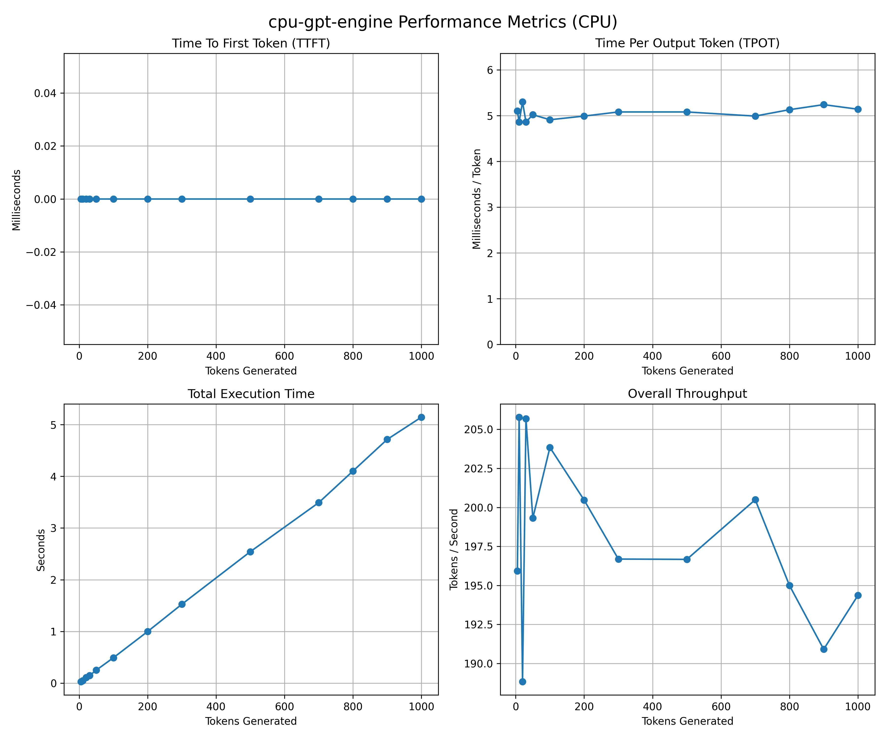

# gpt2-engine-cpp
> Custom GPT2 inference engine built from scratch in C++ and CUDA 

# Overview
Project is meant to be a high performance implementation of
GPT2 (124M parameter) architecture.

# How to Run
`cmake -B build` 
`cmake --build build`
## CPU Version
`./build/src/gpt2_inference_engine_cpu`
## CPU Benchmarks
`./build/benchmarks/cpu_bench`

## CUDA Version
`./build/src/gpt2_inference_engine_cuda`

## CUDA Benchmarks
`./build/benchmarks/gpu_bench`

# Key Features
- Custom CUDA Kernels: Implemented custom multi-head attention, layer normalization, GELU activation, and fuesed matrix operations (only using cuBLAS)
- Cross-Framework Validation: Features and end to end python validation suite guarantees mathemematically identical output to huggingface version
- Deterministic: Can handle precise floating point arithmetic stability across matrix operations
- KV Caching

# Results & Validation

- **Mathematical Correctness:** Achieved Mean Squared Error (MSE) ≈ `0.0` and Maximum Absolute Difference < `1e-3` in FP32 logits compared to PyTorch `F.scaled_dot_product_attention`.

- **Hardware Acceleration (CPU → GPU):** Up to **544x reduction in latency** by replacing sequential CPU matrix operations with custom CUDA kernels.

- **Throughput Scaling:** With KV caching, achieved up to **1872.46x higher token throughput** at longer sequence lengths vs CPU.

- **Hardware Efficiency:** Measured via NVIDIA Nsight Compute (`ncu`), achieving **99.37% branch efficiency**, indicating minimal warp divergence.

- **Memory Safety:** Verified with `valgrind` (CPU) and NVIDIA `compute-sanitizer` (GPU), with **0 memory leaks and 0 invalid memory accesses** across extensive testing.

- **CPU Limitations:** CPU benchmarks beyond 50 tokens were omitted due to impractically long runtimes.

- **Framework Comparison (Specialized vs General-Purpose):** In single-sequence greedy decoding, Cu-Transformer achieved up to **~1.36x higher throughput** and **~1.35x lower total latency** compared to Hugging Face + PyTorch. This gain is primarily due to reduced framework overhead and a specialized fixed-buffer decode path.

# Benchmarking Methodology & Interpretation

The benchmarks demonstrate that Cu-Transformer reduces framework overhead and memory allocation costs by executing custom CUDA kernels directly. The following context is important for interpreting the results:

- **The Baseline (What was compared):** The baseline is Hugging Face `transformers` running PyTorch. Both implementations executed identical greedy (argmax) decoding workloads (`use_cache=True`) on an NVIDIA RTX 3060.

- **Fairness & Interpretation of Results:** Cu-Transformer is a specialized implementation targeting a single decoding strategy (greedy / argmax) with tightly controlled memory layout and execution flow. In contrast, Hugging Face `generate()` is a general-purpose API supporting multiple decoding strategies and batching modes. This comparison should therefore be interpreted as **specialized vs general-purpose execution**, not a universal performance comparison.

- **The JIT / `torch.compile` Context:** PyTorch 2.x `torch.compile` was enabled and does apply to Hugging Face models. However, autoregressive generation limits optimization opportunities due to graph breaks and dynamic shapes. The default dynamic KV cache further reduces compile effectiveness, whereas fixed-size caches are more compatible with JIT-style optimization. Cu-Transformer avoids this by using a fixed-buffer decode path.

- **PyTorch TTFT (Time To First Token):** TTFT is not reported because `model.generate()` is a blocking function that combines prefill and decode phases. Extracting TTFT requires a custom streamer, so the comparison focuses on total latency and throughput.

- **Scope of the Comparison:** This is not a comparison against production inference systems (e.g., vLLM, TensorRT-LLM), which use advanced techniques such as FlashAttention, PagedAttention, and continuous batching.

# CPU vs GPU Benchmark Comparison

| Tokens | CPU TTFT (ms) | GPU TTFT (ms) | Speedup (Latency) | CPU Total Time (s) | GPU Total Time (s) | Speedup (Total Time) | CPU Throughput (tok/s) | GPU Throughput (tok/s) | Speedup (Throughput) |
| ------ | ------------- | ------------- | ----------------- | ------------------ | ------------------ | -------------------- | ---------------------- | ---------------------- | -------------------- |
| 5      | 2919.88       | 5.36          | 544.75x           | 16.6428            | 0.01951            | 852.99x              | 0.30                   | 256.86                 | 856.20x              |
| 10     | 2926.20       | 5.45          | 536.92x           | 38.3236            | 0.03865            | 991.56x              | 0.26                   | 259.34                 | 997.46x              |
| 20     | 2880.89       | 6.11          | 471.50x           | 96.0915            | 0.08435            | 1139.20x             | 0.21                   | 237.23                 | 1129.67x             |
| 30     | 2901.22       | 6.02          | 481.93x           | 174.708            | 0.12706            | 1374.98x             | 0.17                   | 236.18                 | 1389.29x             |
| 50     | 2885.47       | 6.08          | 474.58x           | 390.183            | 0.20542            | 1899.44x             | 0.13                   | 243.42                 | 1872.46x             |
| 100    | N/A           | 6.22          | N/A               | N/A                | 0.43376            | N/A                  | N/A                    | 230.81                 | N/A                  |
| 200    | N/A           | 6.35          | N/A               | N/A                | 0.86553            | N/A                  | N/A                    | 231.54                 | N/A                  |
| 300    | N/A           | 6.27          | N/A               | N/A                | 1.30069            | N/A                  | N/A                    | 230.87                 | N/A                  |
| 500    | N/A           | 5.73          | N/A               | N/A                | 2.07385            | N/A                  | N/A                    | 241.63                 | N/A                  |
| 700    | N/A           | 5.40          | N/A               | N/A                | 2.80812            | N/A                  | N/A                    | 249.50                 | N/A                  |
| 800    | N/A           | 5.52          | N/A               | N/A                | 3.08160            | N/A                  | N/A                    | 259.71                 | N/A                  |
| 900    | N/A           | 5.41          | N/A               | N/A                | 3.46639            | N/A                  | N/A                    | 259.76                 | N/A                  |
| 1000   | N/A           | 5.43          | N/A               | N/A                | 4.06463            | N/A                  | N/A                    | 246.69                 | N/A                  |

---

# PyTorch (Huggingface) vs GPU Benchmark Comparison:

> **Note:** The observed speedup does not imply that Cu-Transformer is universally faster than PyTorch. The improvement comes from specializing for a single decoding path (greedy / argmax) and reducing framework overhead, whereas PyTorch and Hugging Face are designed for generality and flexibility across many use cases.

| Tokens | GPU Total Time (s) | PyTorch Total Time (s) | Speedup (Total Time) | GPU Throughput (tok/s) | PyTorch Throughput (tok/s) | Speedup (Throughput) |
| ------ | ------------------ | ---------------------- | -------------------- | ---------------------- | -------------------------- | -------------------- |
| 5      | 0.01951            | 0.02552                | 0.76x                | 256.86                 | 195.93                     | 1.31x                |
| 10     | 0.03865            | 0.04860                | 0.80x                | 259.34                 | 205.78                     | 1.26x                |
| 20     | 0.08435            | 0.10592                | 0.80x                | 237.23                 | 188.83                     | 1.26x                |
| 30     | 0.12706            | 0.14586                | 0.87x                | 236.18                 | 205.68                     | 1.15x                |
| 50     | 0.20542            | 0.25087                | 0.82x                | 243.42                 | 199.31                     | 1.22x                |
| 100    | 0.43376            | 0.49058                | 0.88x                | 230.81                 | 203.84                     | 1.13x                |
| 200    | 0.86553            | 0.99766                | 0.87x                | 231.54                 | 200.47                     | 1.15x                |
| 300    | 1.30069            | 1.52521                | 0.85x                | 230.87                 | 196.69                     | 1.17x                |
| 500    | 2.07385            | 2.54238                | 0.82x                | 241.63                 | 196.67                     | 1.23x                |
| 700    | 2.80812            | 3.49153                | 0.80x                | 249.50                 | 200.49                     | 1.24x                |
| 800    | 3.08160            | 4.10253                | 0.75x                | 259.71                 | 195.00                     | 1.33x                |
| 900    | 3.46639            | 4.71424                | 0.74x                | 259.76                 | 190.91                     | 1.36x                |
| 1000   | 4.06463            | 5.14497                | 0.79x                | 246.69                 | 194.36                     | 1.27x                |

## Definitions

- `TTFT_cpu` = CPU Time-To-First-Token (ms)  
- `TTFT_gpu` = GPU Time-To-First-Token (ms)  
- `T_cpu` = CPU Total Generation Time (s)  
- `T_gpu` = GPU Total Generation Time (s)  
- `TP_cpu` = CPU Throughput (tokens/sec)  
- `TP_gpu` = GPU Throughput (tokens/sec)  

## Latency Speedup (TTFT)
Measures how much faster GPU produces first token

$$
\text{Speedup}_{latency} =
\frac{TTFT_{cpu}}{TTFT_{gpu}}
$$

---

## Total Time Speedup
Measures overall generation acceleration

$$
\text{Speedup}_{total} =
\frac{T_{cpu}}{T_{gpu}}
$$

---

## Throughput Speedup
Measures how many more tokens per second the GPU generates compared to CPU.

$$
\text{Speedup}_{throughput} =
\frac{TP_{gpu}}{TP_{cpu}}
$$

---

## Example (50 Tokens)

Given:

- `TTFT_cpu = 2885.47 ms`
- `TTFT_gpu = 6.08 ms`
- `T_cpu = 390.183 s`
- `T_gpu = 0.20542 s`
- `TP_cpu = 0.13 tok/s`
- `TP_gpu = 243.42 tok/s`

### Calculations

$$
\text{Latency Speedup} =
\frac{2885.47}{6.08}
= 474.58\times
$$

$$
\text{Total Time Speedup} =
\frac{390.183}{0.20542}
= 1899.44\times
$$

$$
\text{Throughput Speedup} =
\frac{243.42}{0.13}
= 1872.46\times
$$

  

## CPU Performance
 
  

## GPU Performance

## PyTorch (Huggingface) Performance

---
# Hardware & Software
- **GPU:** NVIDIA GeForce RTX 3060  
- **ToolKit:** CUDA Toolkit 13.1.115
- **Libraries:** cuBLAS
- **CMake:** Version 3.20+

---

# Future Work
- Implement FP16 
- Implemente Temperature instead of taking ArgMax
- Fix run_benchmarks to be more user friendly

